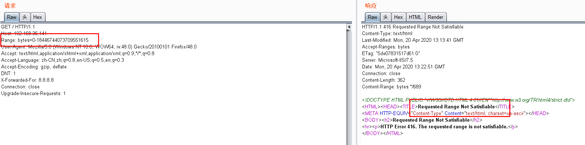

# IIS 漏洞POC

* ### HTTP.sys

  主要存在Windows+IIS的环境下，任何安装了微软IIS 6.0以上的Windows Server 2008 R2/Server 2012/Server 2012 R2以及Windows 7/8/8.1操作系统都受到这个漏洞的影响。编号：**MS-035**

  * 测试语句：**Range: bytes=0-18446744073709551615**

    

  * 补丁链接：https://docs.microsoft.com/zh-cn/security-updates/Securitybulletins/2015/ms15-034

* ### sss