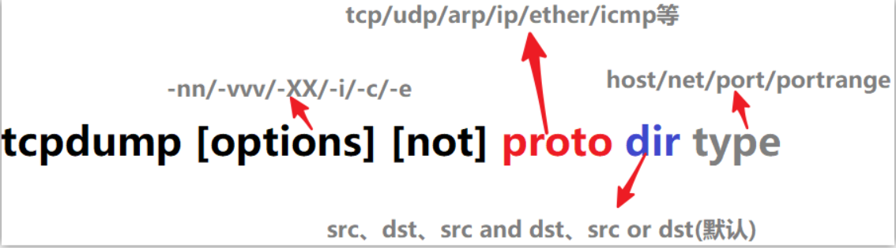

# Linux Shell

## 网络

### tcpdump

- **命令格式**

```shell
tcpdump [ -DenNqvX ] [ -c count ] [ -F file ] [ -i interface ] [ -r file ]
        [ -s snaplen ] [ -w file ] [ expression ]
```



- **命令参数**

```shell
-c 指定要抓取的包数量
-i 指定tcpdump需要监听的接口。默认会抓取第一个网络接口
-n 对地址以数字方式显式，否则显式为主机名，也就是说-n选项不做主机名解析
-P 指定要抓取的包是流入还是流出的包。可以给定的值为"in"、"out"和"inout"，默认为"inout"
-e 输出的每行中都将包括数据链路层头部信息，例如源MAC和目标MAC
-q 快速打印输出。即打印很少的协议相关信息，从而输出行都比较简短
-X 输出包的头部数据，会以16进制和ASCII两种方式同时输出。
-XX 输出包的头部数据，会以16进制和ASCII两种方式同时输出，更详细。
-v 当分析和打印的时候，产生详细的输出。
-vv 产生比-v更详细的输出。
-vvv 产生比-vv更详细的输出
```

**原文链接：https://www.jianshu.com/p/d9162722f189**

---

### traceroute

* **命令格式**

  traceroute指令让你追踪网络数据包的路由途径，预设数据包大小是40Bytes，用户可另行设置

```shellshe l
具体参数格式：traceroute [-dFlnrvx][-f<存活数值>][-g<网关>...][-i<网络界面>][-m<存活数值>][-p<通信端口>][-s<来源地址>][-t<服务类型>][-w<超时秒数>][主机名称或IP地址][数据包大小]
```

- **命令参数**

```
-d 使用Socket层级的排错功能。
-f 设置第一个检测数据包的存活数值TTL的大小。
-F 设置勿离断位。
-g 设置来源路由网关，最多可设置8个。
-i 使用指定的网络界面送出数据包。
-I 使用ICMP回应取代UDP资料信息。
-m 设置检测数据包的最大存活数值TTL的大小。
-n 直接使用IP地址而非主机名称。
-p 设置UDP传输协议的通信端口。
-r 忽略普通的Routing Table，直接将数据包送到远端主机上。
-s 设置本地主机送出数据包的IP地址。
-t 设置检测数据包的TOS数值。
-v 详细显示指令的执行过程。
-w 设置等待远端主机回报的时间。
-x 开启或关闭数据包的正确性检验。
```

---

### shc

- **命令格式**

```shell
shc -e 20/10/2010 -m "过期" -v -r -f test.sh
-e 指定过期时间为2010年10月20日
-m 过期后打印出的信息；
-v 输出打印
-r 可在相同操作系统的不同主机上执行
-f 指定shell文件
```

---

### netstat

* **命令参数**

```shell
-a或--all   显示所有连线中的Socket
-c或--continuous   持续列出网络状态。
-e或--extend   显示网络其他相关信息。
-g或--groups   显示多重广播功能群组组员名单。
-i或--interfaces   显示网络界面信息表单。
-l或--listening   显示监控中的服务器的Socket
-n或--numeric   直接使用IP地址，而不通过域名服务器。
-o或--timers   显示计时器。
-p或--programs   显示正在使用Socket的程序识别码和程序名称。
-r或--route   显示Routing Table。
-s或--statistice   显示网络工作信息统计表。
-t或--tcp   显示TCP传输协议的连线状况。
-u或--udp   显示UDP传输协议的连线状况。
-v或--verbose   显示指令执行过程。
-V或--version   显示版本信息。

```

* **状态说明**

| 状态         | 解释                                                         |
| ------------ | ------------------------------------------------------------ |
| LISTEN       | 侦听来自远方的TCP端口的连接请求                              |
| SYN-SENT     | 再发送连接请求后等待匹配的连接请求（如果有大量这样的状态包，检查是否中招了） |
| SYN-RECEIVED | 再收到和发送一个连接请求后等待对方对连接请求的确认（如有大量此状态，估计被flood攻击了） |
| ESTABLISHED  | 代表一个打开的连接                                           |
| FIN-WAIT-1   | 等待远程TCP连接中断请求，或先前的连接中断请求的确认          |
| FIN-WAIT-2   | 从远程TCP等待连接中断请求                                    |
| CLOSE-WAIT   | 等待从本地用户发来的连接中断请求                             |
| CLOSING      | 等待远程TCP对连接中断的确认                                  |
| LAST-ACK     | 等待原来的发向远程TCP的连接中断请求的确认（不是什么好东西，此项出现，检查是否被攻击） |
| TIME-WAIT    | 等待足够的时间以确保远程TCP接收到连接中断请求的确认          |
| CLOSED       | 没有任何连接状态                                             |

**组合参考：https://www.jianshu.com/p/c72e4591a190**

---


---

## 系统

### history

```
history命令来获取用户的命令执行历史记录
```

---

### xargs

xargs全称是transform arguments，意为转换参数，它将标准输入转换为命令行参数。因为linux命令行中经常要使用到管道符连接不同的命令，但是有些命令不支持标准输入，此时就需要使用xargs将标准输入转换为参数。

- **格式**

```shell
input | xargs [option] cmd
```

- **常见使用**

```shell
====
echo arg1 arg2 arg3 | xargs echo
arg1 arg2 arg3
====
#删除
find / -name {name} | xargs rm -rf
```

---

### firewalld

* **命令格式**

```shell
1、开放端口
firewall-cmd --zone=public --add-port=5672/tcp --permanent   # 开放5672端口
firewall-cmd --zone=public --remove-port=5672/tcp --permanent  #关闭5672端口
firewall-cmd --reload   # 配置立即生效
 
2、查看防火墙所有开放的端口
firewall-cmd --zone=public --list-ports
 
3.、关闭防火墙
如果要开放的端口太多，嫌麻烦，可以关闭防火墙，安全性自行评估
systemctl stop firewalld.service
 
4、查看防火墙状态
 firewall-cmd --state

```

---

