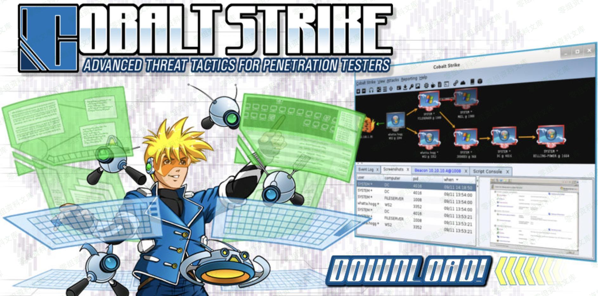

# Cobalt Strike

多人运动领导者



## 界面翻译

### 导航栏

- **Cobalt Strike**

```
New Connection	  #新的连接(支持连接多个服务器端)
Preferences 			#偏好设置(设置Cobal Strike界面、控制台、以及输出报告样式、TeamServer连接记录等)
Visualization 		#窗口视图模式(展示输出结果的形式)
VPN Interfaces 		#VPN接入
Listenrs 					#监听器(创建Listener)
Script Manager 		#脚本管理
Close 						#关闭
```

- **View**

```
Applications 		 #应用(显示受害者机器的应用信息)
Credentials 		 #凭证(通过hashdump或Mimikatz抓取过的密码都会储存在这里)
Downloads  			 #下载文件
Event Log  			 #事件日志(主机上线记录以及团队协作聊天记录)
Keystrokes   		 #键盘记录
Proxy Pivots 		 #代理模块
Screenshots      #截图
Script Console   #脚本控制台(可以加载各种脚本，增强功能https://github.com/rsmudge/cortana-scripts)
Targets 				 #显示目标主机
Web Log          #Web日志
```

- **Attacks**

```
#Packages
--------
HTML Application				#生成恶意的HTA木马文件
MS Office Macro					#生成office宏病毒文件
Payload Generator 			#生成各种语言版本的payload
USB/CD AutoPlay 				#生成利用自动播放运行的木马文件
Windows Dropper 				#捆绑器，能够对文档类进行捆绑
Windows Executable 		  #生成可执行Payload
Windows Executable(S) 	#把包含payload,Stageless生成可执行文件(包含多数功能)

#Web Drive-by
--------
Manage 									#对开启的web服务进行管理
Clone Site 							#克隆网站(可记录受害者提交的数据)
Host File 							#提供Web以供下载某文件
Scripted Web Delivery 	#提供Web服务，便于下载和执行PowerShell Payload
Signed Applet Attack 		#启动一个Web服务以提供自签名Java Applet的运行环境
Smart Applet Attack 		#自动检测Java版本并利用已知的exploits绕过security
System Profiler 				#用来获取一些系统信息，比如系统版本，Flash版本，浏览器版本等
```

- **Reporting**

```
0. Activity report 											#活动报告
1. Hosts report 												#主机报告
2. Indicators of Compromise 						#威胁报告
3. Sessions report 											#会话报告
4. Social engineering report 						#社会工程学报告
5. Tactics, Techniques, and Procedures 	#策略、技巧和程序  
Reset Data 															#重置数据
Export Data 														#导出数据
```

### 右键参数

- **interact**

```
进入Beacon
```

- **Access**

```
Dump Hashes 		#获取hash
Elevate 				#提权
Golden Ticket 	#生成黄金票据注入当前会话
Make token 			#凭证转换
Run Mimikatz 		#运行 Mimikatz 
Spawn As 				#用其他用户生成Cobalt Strike侦听器
```

- **Explore**

```
Browser Pivot 	#劫持目标浏览器进程
Desktop(VNC) 		#桌面交互
File Browser 		#文件浏览器
Net View 				#命令Net View
Port Scan 			#端口扫描
Process List 		#进程列表
Screenshot 			#截图
```

- **Pivoting**

```
SOCKS Server 		#代理服务
Listener 				#反向端口转发
Deploy VPN 			#部署VPN
```

- **Spawn**

```
外部监听器(如指派给MSF，获取meterpreter权限)
```

- **Session**

```
Note 						#备注
Remove 					#删除
Sleep 					#指定被控端休眠时间，默认60秒一次回传，让被控端每10秒来下载一次任务。
Exit 						#退出
```

## Cobalt Strike Beacon 命令详情

```
beacon> help

Beacon Commands
===============

    Command                   Description
    -------                   -----------
    argue                     进程参数欺骗
    blockdlls                 阻止子进程加载非Microsoft DLL
    browserpivot              注入受害者浏览器进程
      bypassuac                 绕过UAC提升权限
    cancel                    取消正在进行的下载
    cd                        切换目录
    checkin                   强制让被控端回连一次
    clear                     清除beacon内部的任务队列
    connect                   Connect to a Beacon peer over TCP
    covertvpn                 部署Covert VPN客户端
    cp                        复制文件
    dcsync                    从DC中提取密码哈希
    desktop                   远程桌面(VNC)
    dllinject                 反射DLL注入进程
    dllload                   使用LoadLibrary将DLL加载到进程中
    download                  下载文件
    downloads                 列出正在进行的文件下载
    drives                    列出目标盘符
    elevate                   使用exp
    execute                   在目标上执行程序(无输出)
    execute-assembly          在目标上内存中执行本地.NET程序
    exit                      终止beacon会话
    getprivs                  Enable system privileges on current token
    getsystem                 尝试获取SYSTEM权限
    getuid                    获取用户ID
    hashdump                  转储密码哈希值
    help                      帮助
    inject                    在注入进程生成会话
    jobkill                   结束一个后台任务
    jobs                      列出后台任务
    kerberos_ccache_use       从ccache文件中导入票据应用于此会话
    kerberos_ticket_purge     清除当前会话的票据
    kerberos_ticket_use       Apply 从ticket文件中导入票据应用于此会话
    keylogger                 键盘记录
    kill                      结束进程
    link                      Connect to a Beacon peer over a named pipe
    logonpasswords            使用mimikatz转储凭据和哈希值
    ls                        列出文件
    make_token                创建令牌以传递凭据
    mimikatz                  运行mimikatz
    mkdir                     创建一个目录
    mode dns                  使用DNS A作为通信通道(仅限DNS beacon)
    mode dns-txt              使用DNS TXT作为通信通道(仅限D beacon)
    mode dns6                 使用DNS AAAA作为通信通道(仅限DNS beacon)
    mode http                 使用HTTP作为通信通道
    mv                        移动文件
    net                       net命令
    note                      备注       
    portscan                  进行端口扫描
    powerpick                 通过Unmanaged PowerShell执行命令
    powershell                通过powershell.exe执行命令
    powershell-import         导入powershell脚本
    ppid                      Set parent PID for spawned post-ex jobs
    ps                        显示进程列表
    psexec                    Use a service to spawn a session on a host
    psexec_psh                Use PowerShell to spawn a session on a host
    psinject                  在特定进程中执行PowerShell命令
    pth                       使用Mimikatz进行传递哈希
    pwd                       当前目录位置
    reg                       Query the registry
    rev2self                  恢复原始令牌
    rm                        删除文件或文件夹
    rportfwd                  端口转发
    run                       在目标上执行程序(返回输出)
    runas                     以其他用户权限执行程序
    runasadmin                在高权限下执行程序
    runu                      Execute a program under another PID
    screenshot                屏幕截图
    setenv                    设置环境变量
    shell                     执行cmd命令
    shinject                  将shellcode注入进程
    shspawn                   启动一个进程并将shellcode注入其中
    sleep                     设置睡眠延迟时间
    socks                     启动SOCKS4代理
    socks stop                停止SOCKS4
    spawn                     Spawn a session 
    spawnas                   Spawn a session as another user
    spawnto                   Set executable to spawn processes into
    spawnu                    Spawn a session under another PID
    ssh                       使用ssh连接远程主机
    ssh-key                   使用密钥连接远程主机
    steal_token               从进程中窃取令牌
    timestomp                 将一个文件的时间戳应用到另一个文件
    unlink                    Disconnect from parent Beacon
    upload                    上传文件
    wdigest                   使用mimikatz转储明文凭据
    winrm                     使用WinRM横向渗透
    wmi                       使用WMI横向渗透
```

## 监听器介绍

