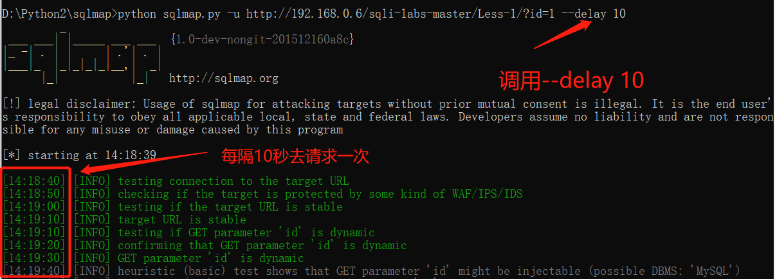

# SQLmap

## 用法

- **常用命令**

```shell
-u 指定目标URL (可以是http协议也可以是https协议)
-d 连接数据库
-data data指定的数据会当做post数据提交
--dbs 列出所有的数据库
--current-db 列出当前数据库
--tables 列出当前的表
--columns 列出当前的列
-D 选择使用哪个数据库
-T 选择使用哪个表
-C 选择使用哪个列
--dump 获取字段中的数据
--batch 自动选择yes
--smart 启发式快速判断，节约浪费时间
--forms 尝试使用post注入
-r 加载文件中的HTTP请求（本地保存的请求包txt文件）
-l 加载文件中的HTTP请求（本地保存的请求包日志文件）
-g 自动获取Google搜索的前一百个结果，对有GET参数的URL测试
-o 开启所有默认性能优化
--tamper 调用脚本进行注入
-v 指定sqlmap的回显等级
--delay 设置多久访问一次
--os-shell –-os-cmd=["命令"] 获取主机shell
-m 批量操作
-c 指定配置文件，会按照该配置文件执行动作
-timeout 设定超时时间
-level 设置注入探测等级
--risk 风险等级
--identify-waf 检测防火墙类型
--param-del="分割符" 设置参数的分割符
--skip-urlencode 不进行url编码
--keep-alive 设置持久连接，加快探测速度
--null-connection 检索没有body响应的内容，多用于盲注
--thread 最大为10 设置多线程
```

- **部分命令详细**

```shell
--delay 有些web服务器请求访问太过频繁可能会被防火墙拦截，使用--delay就可以设定两次http请求的延时
```



```shell
--tamper ["脚本名称"] 当调用多个脚本的时候，脚本之间用逗号隔开，调用的脚本在 sqlmap文件夹下的 tamper 文件夹中

apostrophemask.py              用UTF-8全角字符替换单引号字符
apostrophenullencode.py        用非法双字节unicode字符替换单引号字符
appendnullbyte.py              在payload末尾添加空字符编码
base64encode.py                对给定的payload全部字符使用Base64编码
between.py                     分别用“NOT BETWEEN 0 AND #”替换大于号“>”，“BETWEEN # AND #”替换等于号“=”
bluecoat.py                    在SQL语句之后用有效的随机空白符替换空格符，随后用“LIKE”替换等于号“=”
chardoubleencode.py            对给定的payload全部字符使用双重URL编码（不处理已经编码的字符）
charencode.py                  对给定的payload全部字符使用URL编码（不处理已经编码的字符）
charunicodeencode.py           对给定的payload的非编码字符使用Unicode URL编码（不处理已经编码的字符）
concat2concatws.py            用“CONCAT_WS(MID(CHAR(0), 0, 0), A, B)”替换像“CONCAT(A, B)”的实例
equaltolike.py                用“LIKE”运算符替换全部等于号“=”
greatest.py                   用“GREATEST”函数替换大于号“>”
halfversionedmorekeywords.py  在每个关键字之前添加MySQL注释
ifnull2ifisnull.py            用“IF(ISNULL(A), B, A)”替换像“IFNULL(A, B)”的实例
lowercase.py                  用小写值替换每个关键字字符
modsecurityversioned.py       用注释包围完整的查询
modsecurityzeroversioned.py   用当中带有数字零的注释包围完整的查询
multiplespaces.py             在SQL关键字周围添加多个空格
nonrecursivereplacement.py    用representations替换预定义SQL关键字，适用于过滤器
overlongutf8.py               转换给定的payload当中的所有字符
percentage.py                 在每个字符之前添加一个百分号
randomcase.py                 随机转换每个关键字字符的大小写
randomcomments.py             向SQL关键字中插入随机注释
securesphere.py               添加经过特殊构造的字符串
sp_password.py                向payload末尾添加“sp_password” for automatic obfuscation from DBMS logs
space2comment.py              用“/**/”替换空格符
space2dash.py                 用破折号注释符“--”其次是一个随机字符串和一个换行符替换空格符
space2hash.py                 用磅注释符“#”其次是一个随机字符串和一个换行符替换空格符
space2morehash.py             用磅注释符“#”其次是一个随机字符串和一个换行符替换空格符
space2mssqlblank.py           用一组有效的备选字符集当中的随机空白符替换空格符
space2mssqlhash.py            用磅注释符“#”其次是一个换行符替换空格符
space2mysqlblank.py           用一组有效的备选字符集当中的随机空白符替换空格符
space2mysqldash.py            用破折号注释符“--”其次是一个换行符替换空格符
space2plus.py                 用加号“+”替换空格符
space2randomblank.py          用一组有效的备选字符集当中的随机空白符替换空格符
unionalltounion.py            用“UNION SELECT”替换“UNION ALL SELECT”
unmagicquotes.py              用一个多字节组合%bf%27和末尾通用注释一起替换空格符 宽字节注入
varnish.py                    添加一个HTTP头“X-originating-IP”来绕过WAF
versionedkeywords.py          用MySQL注释包围每个非函数关键字
versionedmorekeywords.py      用MySQL注释包围每个关键字
xforwardedfor.py              添加一个伪造的HTTP头“X-Forwarded-For”来绕过WAF 
```

- **案例**

Get、POST方法，常规注入

```shell
sqlmap -u ["URL"] //测试是否存在注入
sqlmap -u ["URL"] -current-db //查询当前数据库
sqlmap -u ["URL"] -D ["数据库名"] --tables //查询当前数据库中的所有表
sqlmap -u ["URL"] -D ["数据库名"] -T ["表名"] --columns //查询指定库中指定表的所有列(字段)
sqlmap -u ["URL"] -D ["数据库名"] -T ["表名"] -C ["列名"] --dump //打印出指定库中指定表指定列中的字段内容
```

**项目地址：https://github.com/sqlmapproject/sqlmap/**

