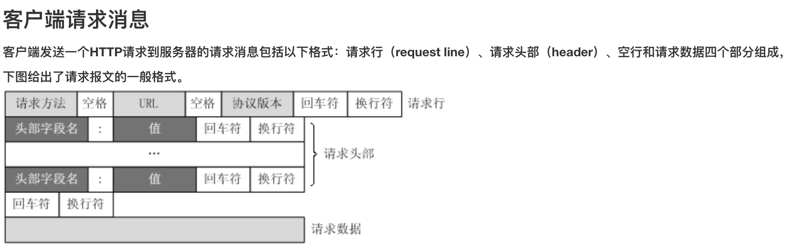
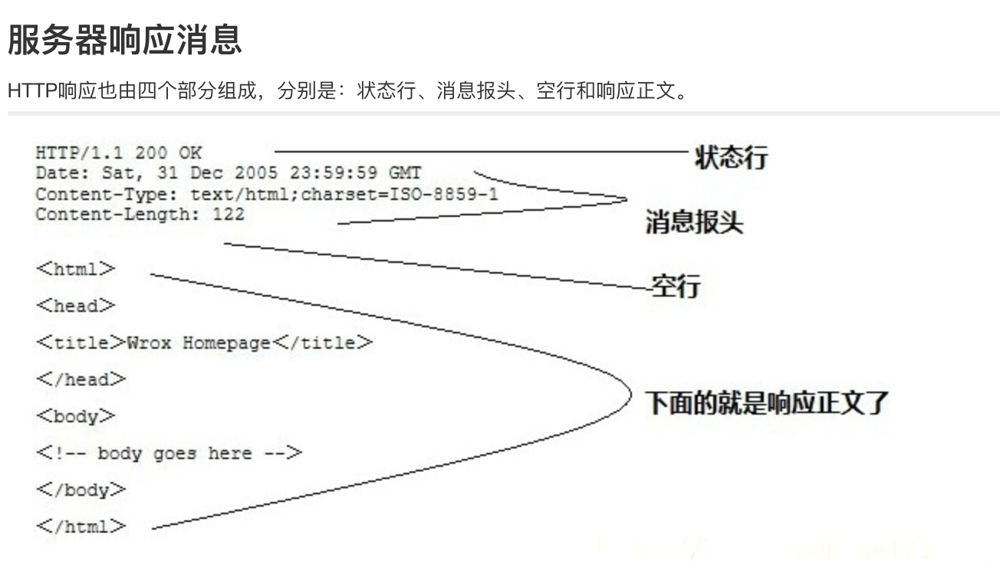

# HTTP 协议

超文本传输协议

## 请求头

一个HTTP请求报文由四个部分组成：请求行、请求头部、空行、请求数据

* **请求方法**

| 方法    | 解释                                                        |
| ------- | ----------------------------------------------------------- |
| OPTIONS | 返回服务器针对特定资源所支持的HTTP请求方法                  |
| HEAD    | 向服务器索要与GET请求相一致的响应，只不过响应体将不会被返回 |
| TRACE   | 回显服务器收到的请求，主要用于测试或诊断                    |
| PUT     | 向指定资源位置上传其最新内容                                |
| DELETE  | 请求服务器删除 Request-URI 所标识的资源                     |
| CONNECT | HTTP/1.1 协议中预留给能够将连接改为管道方式的代理服务器     |

- **常见的请求头字段含义**

| 参数              | 解释                                                         |
| ----------------- | ------------------------------------------------------------ |
| Accept            | 浏览器可接受的MIME类型                                       |
| Accept-Charset    | 浏览器可接受的字符集                                         |
| Accept-Encoding   | 浏览器能够进行解码的数据编码方式                             |
| Accept-Language   | 浏览器所希望的语言种类，当服务器能够提供一种以上的语言版本时要用到 |
| Authorization     | 授权信息，Basic [ base64 ]                                   |
| Content-Length    | 表示请求消息正文的长度                                       |
| If-Modified-Since | 客户机通过这个头告诉服务器，资源的缓存时间                   |
| Referer           | 客户机通过这个头告诉服务器，它是从哪个资源来访问服务器的     |
| User-Agent        | 内容包含发出请求的用户信息                                   |
| Connection        | 处理完这次请求后是否断开连接还是继续保持连接                 |
| Range             | 可以请求实体的一个或者多个子范围                             |

## 响应头

同样的，HTTP响应报文也由三部分组成：响应行、响应头、响应体

- **常见的响应头字段含义**

| 方法              | 解释                                                         |
| ----------------- | ------------------------------------------------------------ |
| Allow             | 服务器支持哪些请求方法                                       |
| Content-Encoding  | 文档的编码(Encode)方法。只有在解码之后才可以得到Content-Type头指定的内容类型 |
| Content-Length    | 表示内容长度                                                 |
| Content- Type     | 表示后面的文档属于什么MIME类型。Servlet默认为text/html       |
| Date              | 当前的GMT时间                                                |
| Expires           | 告诉浏览器把回送的资源缓存多长时间，-1或0则是不缓存          |
| Last-Modified     | 文档的最后改动时间。可以通过If-Modified-Since请求头提供一个日期 |
| Location          | 这个头配合302状态码使用，用于重定向接收者到一个新URI地址     |
| Refresh           | 告诉浏览器隔多久刷新一次，以秒计                             |
| Serve             | 服务器通过这个头告诉浏览器服务器的类型                       |
| Set-Cookie        | 设置和页面关联的Cookie                                       |
| Transfer-Encoding | 告诉浏览器数据的传送格式                                     |
| WWW-Authenticate  | 客户应该在Authorization头中提供什么类型的授权信息            |
| setContentType    | 设置Content-Type头                                           |
| setContentLength  | 设置Content-Length头                                         |
| addCookie         | 设置一个Cookie                                               |

* **常见的响应体含义**

| 方法                | 解释                                     |
| ------------------- | ---------------------------------------- |
| Content-Encoding    | 服务器通过这个头告诉浏览器数据的压缩格式 |
| Content-Length      | 服务器通过这个头告诉浏览器回送数据的长度 |
| Content-Disposition | 告诉浏览器以下载方式打开数据             |
| Content-Type        | 服务器通过这个头告诉浏览器回送数据的类型 |

